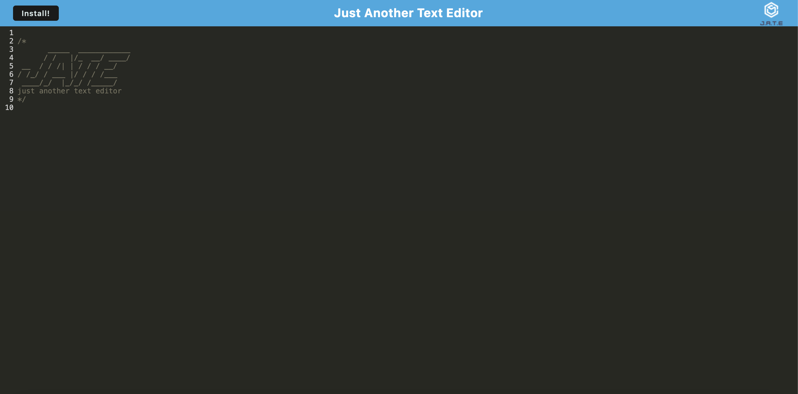

# gotstyle

## Technology Used:

| Technology Used | Resource URL | 
| ------------- |:-------------:| 
| HTML | [https://developer.mozilla.org/en-US/docs/Web/HTML](https://developer.mozilla.org/en-US/docs/Web/HTML) | 
| CSS | [https://developer.mozilla.org/en-US/docs/Web/CSS](https://developer.mozilla.org/en-US/docs/Web/CSS) | 
| Git | [https://git-scm.com/](https://git-scm.com/) | 
| Node |[https://developer.mozilla.org/en-US/docs/Glossary/Node.js](https://developer.mozilla.org/en-US/docs/Glossary/Node.js) |
| NPM | [https://www.npmjs.com/](https://www.npmjs.com/) |
| Express | [https://developer.mozilla.org/en-US/docs/Learn/Server-side/Express_Nodejs](https://developer.mozilla.org/en-US/docs/Learn/Server-side/Express_Nodejs) |
| Webpack | [https://webpack.js.org/concepts/](https://webpack.js.org/concepts/) |
| Workbox Webpack Plugin | [https://www.npmjs.com/package/workbox-webpack-plugin](https://www.npmjs.com/package/workbox-webpack-plugin)| 
| Babel | [https://babeljs.io/](https://babeljs.io/) |
| Heroku | [https://devcenter.heroku.com/categories/reference](https://devcenter.heroku.com/categories/reference) |
| Javascript | [https://developer.mozilla.org/en-US/docs/Web/JavaScript](https://developer.mozilla.org/en-US/docs/Web/JavaScript) |

 ## Description

A Fullstack text editor application with offline capabilities that can be downloaded/installed on your computer. 

[Visit Deployed link](https://gotstyle-6798d38fdfed.herokuapp.com/)

 ## Table of Contents
  
   * [Installation](#installation)
   * [Usage](#usage)
   * [License](#license)
   * [Badges](#badges)
   * [Tests](#tests)
   * [Contributing](#contributing)
   * [Credits](#credits)

## Installation

* To install all dependences, run: npm install
* To build and start the server, run: npm run start

## Usage

Just another text editor.  You can install the app onto a local computer just by clicking the install button.

## License

 This project is licensed with MIT license

 Link to License - [Website to MIT License]((https://opensource.org/license/mit))

 ## Tests
 
 No testing for this application

 ## Contributing

 For questions concerning contributing please contact me at any of the following:

 [github](https://github.com/Armand57araujo) or [email](mailto:armand_araujo@yahoo.com)

## Author Info
Armand Araujo
Age: 28
Location: Santa Barbara, CA

 
* [LinkedIn](https://www.linkedin.com/in/armand-araujo-a82ba2291/) 
* [Github](https://github.com/Armand57araujo) 

## Credits 